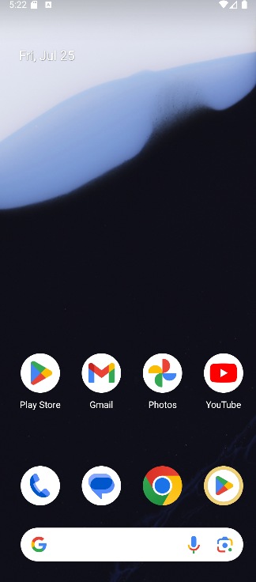
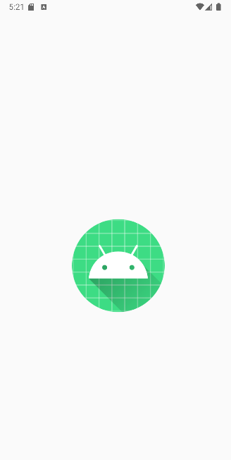

# 📱 Posts App

The app is built using **Jetpack Compose** and follows a clean **MVVM architecture**, with proper **state management** and **network handling** using Retrofit.

## 🚀 Features

- ✅ Fetches and displays posts from:  
  `https://jsonplaceholder.typicode.com/posts`
- ✅ Jetpack Compose UI with `LazyColumn`
- ✅ Clean MVVM architecture
- ✅ Retrofit-based Repository for API calls
- ✅ UI State Management using a sealed class `UiState<T>`
  - Loading state → shows progress bar
  - Success state → displays list of posts
  - Error state → shows retry button
- ✅ Manual dependency injection 

## 🧱 Architecture Overview

### MVVM Layers:
- **Model** → Data classes (`Post`)
- **Repository** → Handles API using Retrofit
- **ViewModel** → Exposes `StateFlow<UiState<List<Post>>>`
- **UI (Jetpack Compose)** → Observes and responds to state

## 🛠 Tech Stack
- Kotlin
- Jetpack Compose
- MVVM
- Retrofit
- Coroutines
- StateFlow / LiveData

## ▶ How to Run
- Clone the repository
`git clone https://github.com/your-username/bluesense-task.git`
- Open in Android Studio
- Click Run (select emulator or device)

## 📸 Screenshots

### 🏠 Home Screen

### ⏳ Loading State

